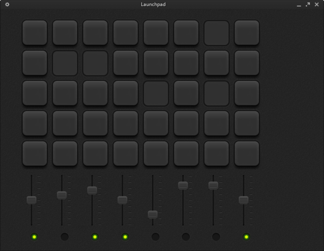

# Launchpad

This is an application inspired by the [Novation Launchpad](http://us.novationmusic.com/midi-controllers-digital-dj/launchpad) hardware.

It was created so I can use it to play with different samples/effects, just for fun! :D  
It is a cool way of taking a first look at how some sounds work together, and can serve as an inspiration for music creation.

---

# Basic controls

* **Buttons**  
Buttons are used to play/stop the samples loaded into the application.  
The first 3 rows of buttons in the application interface are connected to the home row of the keyboard, and the rows above and below it.
Bottom 2 rows of the application are at the moment useless, as they were not assigned any keyboard key yet.

* **Sliders**  
Sliders are used to control the volume of each of the 8 channels available for the samples.  
Numbers from 1 to 8 toggle selection of the respective slider.  
Number 9 selects all the sliders.  
Number 0 deselects all the sliders  
Up and down arrows modify the state of the sliders currently selected, those with the green led at the bottom. 

---

#Loading samples

The configuration file 'samples.cfg' (in the root dir) contains the information about the samples that will be loaded into the application once it is executed.

ATENTION: It is recomended to use OGG files, as other formats have caused small playback problems.

The sounds provided are free samples from [Loopmasters](http://www.loopmasters.com/) converted to OGG usign [media.io](http://media.io)

---

# Contribute

Know how to code? Just fork the repo and add some ideas to the application.

Know about graphic design? A better GUI would be great, contact me.

Or you can use the app and suggest anything you think about.

---

# Screenshot

  
---

# Development

Launchpad uses the [Gosu library](http://www.libgosu.org) for the graphic user interface.

---

# Known bugs

* Problems detected playing some wav files
